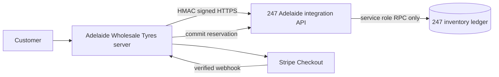

# Adelaide Wholesale Tyres and 247 inventory integration



247 is the only stock authority. Adelaide retains catalogue content and public prices only. Catalogue availability is a batched, short-lived read through Adelaide's server route. Checkout never trusts it: it makes a live, atomic 247 reservation.

## Authentication and configuration

Adelaide server-only variables:

```text
INVENTORY_API_URL=https://inventory.example.com
INVENTORY_CLIENT_ID=adelaide-wholesale-tyres
INVENTORY_CLIENT_SECRET=replace-with-long-random-secret
INVENTORY_LOCATION_ID=247-regency-park-location-uuid
```

247 server-only variables:

```text
AWT_INVENTORY_CLIENT_ID=adelaide-wholesale-tyres
AWT_INVENTORY_CLIENT_SECRET=the-same-long-random-secret
AWT_INVENTORY_LOCATION_ID=247-regency-park-location-uuid
CRON_SECRET=separate-long-random-secret
```

Every Adelaide request signs `METHOD`, path, Unix timestamp, UUID request ID, and SHA-256 body hash. 247 verifies HMAC in constant time, validates a five-minute timestamp window, validates strict Zod input, and reaches its RPCs only with the service role. No browser receives an integration secret or Supabase service-role credential.

## Lifecycle and recovery

1. Adelaide creates one UUID checkout-attempt ID and derives a stable order reference.
2. 247 atomically locks all mapped Regency Park balances, checks `available = on_hand - reserved`, and creates a 45-minute hold (`INVENTORY_HOLD_MINUTES`). The Stripe Checkout Session is created with a 30-minute `expires_at` (`STRIPE_SESSION_TTL_MINUTES`), so a late payment can never land on an already-released hold.
3. Adelaide persists the reservation ID and commit/release request IDs with the durable order.
4. A verified paid Stripe webhook persists the payment and a durable `inventory_outbox` commit row in one transaction (the Stripe event id is the idempotency gate), then a leased worker commits the hold exactly once; 247 records `stock_out` movement with `source_type=adelaide_wholesale_tyres`, integration actor data, and source order reference. `GET /api/cron/inventory-outbox` (`CRON_SECRET`, scheduled every 5 minutes by GitHub Actions — see below) drains anything the webhook's inline pass did not finish.
5. Failed/expired payment queues a release for the hold the same way. Refund does not restock; physical returns must use the normal 247 return workflow. Full design and state model: `docs/payment-inventory-reconciliation.md`.

Reservation and commit request IDs are idempotent. The reservation identity is the canonical hash of `orderReference` plus the sorted `(mapping, quantity)` lines — the hold expiry is a retry parameter, not identity — so a retry of the same checkout attempt after a lost response converges on the same hold. Reusing a request ID with a different payload is rejected (`IDEMPOTENCY_KEY_REUSED`). Commit identity is the durable commit request ID stored with the Adelaide order. A commit validates the order reference while holding the reservation row, before posting any movement. Expired holds are released by the protected 247 cron endpoint and opportunistically by inventory calls.

## Outbox scheduler: why GitHub Actions, not Vercel Cron

`GET /api/cron/inventory-outbox` is the only thing that needs scheduling — it drains
whatever the webhook's inline fast path (`FAST_PATH_LIMIT`, `lib/webhook-handlers.ts`)
didn't finish: retried commits/releases, notification retries, and anything queued
while 247 or Resend was down.

Vercel's **Hobby** plan only allows cron jobs that run once a day (Vercel fails
the deployment of any more frequent expression). This project needs a 5-minute
cadence, so `vercel.json` no longer declares a `crons` block — leaving one in
would either fail to deploy or sit there permanently reporting
`not deployed` from `vercel crons ls`, which is misleading. The route itself is
unchanged and still lives at `/api/cron/inventory-outbox`.

The actual production scheduler is `.github/workflows/inventory-outbox-cron.yml`:

- **Schedule:** `*/5 * * * *` (also runs on `workflow_dispatch` for a manual/ad-hoc trigger).
- **What it does:** one `curl` to `https://adelaidewholesaletyres.com.au/api/cron/inventory-outbox` with `Authorization: Bearer $INVENTORY_CRON_SECRET`, a 30s timeout, and a non-zero exit (workflow shows red) on anything but HTTP 200.
- **Secret required:** repository secret `INVENTORY_CRON_SECRET` in GitHub → Settings → Secrets and variables → Actions. Its value must match the `CRON_SECRET` environment variable set on the Adelaide Vercel project (Production). Rotate both together — changing one without the other locks the scheduler out (fails closed: the route returns 401, it never invents a "success" response).
- **Manually triggering it:** GitHub → Actions → "Inventory outbox cron" → Run workflow. Useful to drain the outbox immediately after an incident instead of waiting up to 5 minutes.
- **Checking failed runs:** GitHub → Actions → "Inventory outbox cron" — a red run means either the HTTP call failed (network/timeout) or the route didn't return 200 (check the logged response body, which only ever contains the safe `{processed, completed, retried, manualReview, notifications}` counters — never a secret or customer data).
- **If GitHub Actions is temporarily unavailable:** nothing is lost. The webhook's inline drain still processes new paid/cancelled orders as they happen; only the backstop for already-failed items pauses. The outbox is durable Postgres state (`inventory_outbox`, leased and idempotent — see `docs/payment-inventory-reconciliation.md`), so a delayed drain just means delayed retries, never a lost or duplicated commit. Once the scheduler resumes (or someone triggers it manually), it picks up exactly where it left off.

## Failure states

| Situation | Adelaide state | 247 state | Recovery |
| --- | --- | --- | --- |
| 247 unreachable at checkout | 503 "We're confirming tyre availability…", no order | none | customer retries |
| Hold made, Adelaide never got the response | 503, no order | active hold | same checkout attempt retries → same hold; otherwise the hold expires |
| Hold made, Stripe session creation (or order persistence) failed | 502, no order | released (signed DELETE) | customer retries |
| Paid, 247 down at commit | order `paid`, `inventory_status=commit_pending`, webhook 200 | active hold | outbox worker retries with backoff under the same commit request ID |
| Commit done, Adelaide never got the response | as above | committed | worker replays the same commit request ID → no second deduction |
| Paid, hold no longer active (conflict) or 8 failed attempts | order `paid`, `inventory_status=manual_review`, staff emailed "NEEDS REVIEW" | released/expired | operator reacquires stock in 247 or refunds |
| Paid order with no reservation recorded | order `paid`, `inventory_status=manual_review`, no outbox row | — | manual investigation |
| Payment failed / session expired | order `failed`/`cancelled`, `release_pending` → `released` | released | release retried by the worker if 247 was down |
| Full refund | order `refunded`, inventory stays `committed`, not notifiable | committed | a physical return is a normal 247 stock-in |
| Partial refund | order stays `paid`/fulfilable; audit only | committed | — |

The 247 auth middleware (`proxy.ts`) excludes `/api/integrations/`; those routes are protected solely by the HMAC boundary and are never redirected to `/login`. Reference (invoice/EFT) orders hold stock for the same window and then expire; the business confirms them manually.

## Mapping and rollout

The additive 247 migration seeds only exact normalized brand/pattern/size matches, once. Runtime processing uses only the permanent mapping UUID and its 247 product foreign key; it never fuzzy matches text. The explicitly unmapped `Greforce / G-PILOT X1 / 295/80R22.5` cannot be purchased online and displays a contact state.

Deploy in this order: apply the 247 migration; deploy 247 API and configure its secret/location; verify signed availability; configure Adelaide variables; deploy Adelaide; run a controlled reservation/payment/commit test; monitor reconciliation. Keep Adelaide integration disabled or checkout unavailable if 247 is unhealthy.

Rollback: disable Adelaide checkout/integration variables or route traffic before reverting application code. Do not delete or reverse 247 ledger movements. Existing holds may be safely released by the authenticated expiry endpoint or allowed to expire.

## Reconciliation

Run `supabase/reconciliation/adelaide-inventory.sql` in the 247 database with a service-role/admin connection. On the Adelaide side, `node --conditions=react-server scripts/inventory-reconcile.mjs` checks the static mapping (24 / 1 / 0) and, with `DATABASE_URL` (order store) and `INVENTORY_DATABASE_URL` (247 Postgres) set, cross-checks every order that holds stock against its 247 reservation and sale movement. `mapping_not_seeded_in_247` must come back empty in production before online checkout is enabled. It only reports discrepancies: unmapped/duplicate mappings, expired active holds, invalid balance state, and Adelaide movements lacking their reservation/order reference. Investigate before any manual correction; use normal 247 ledger adjustments, never direct balance updates.

## Local cross-system verification

`npm run test:cross-system` (tests/cross-system) drives a local `next start` of this site against a local 247 (`next start -p 3101`) through a fault-injecting loopback proxy, with a loopback Stripe stand-in and the local disposable Supabase. It proves the full path — availability, reservation, signed-webhook commit, duplicate and replayed commits, internal 247 stock-outs, concurrent oversell, outage fail-closed, lost-response retries, refund-no-restock and the unmapped product — without any network egress. The loopback-only overrides it relies on (`INVENTORY_ALLOW_INSECURE_LOOPBACK`, `STRIPE_API_BASE`, `NOTIFY_API_BASE`) are ignored for any non-loopback host. Browser tests (`npm run test:e2e`) declare availability through `tests/e2e/support/availability.ts` because the Playwright server has no 247 connection.
