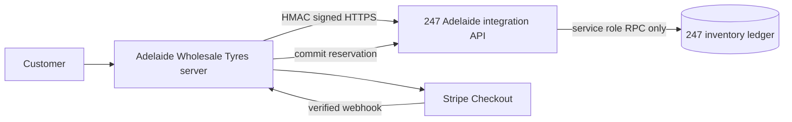

# Adelaide Wholesale Tyres and 247 inventory integration



247 is the only stock authority. Adelaide retains catalogue content and public prices only. Catalogue availability is a batched, short-lived read through Adelaide's server route. Checkout never trusts it: it makes a live, atomic 247 reservation.

## Authentication and configuration

Adelaide server-only variables:

```text
INVENTORY_API_URL=https://inventory.example.com
INVENTORY_CLIENT_ID=adelaide-wholesale-tyres
INVENTORY_CLIENT_SECRET=replace-with-long-random-secret
INVENTORY_LOCATION_ID=247-regency-park-location-uuid
```

247 server-only variables:

```text
AWT_INVENTORY_CLIENT_ID=adelaide-wholesale-tyres
AWT_INVENTORY_CLIENT_SECRET=the-same-long-random-secret
AWT_INVENTORY_LOCATION_ID=247-regency-park-location-uuid
CRON_SECRET=separate-long-random-secret
```

Every Adelaide request signs `METHOD`, path, Unix timestamp, UUID request ID, and SHA-256 body hash. 247 verifies HMAC in constant time, validates a five-minute timestamp window, validates strict Zod input, and reaches its RPCs only with the service role. No browser receives an integration secret or Supabase service-role credential.

## Lifecycle and recovery

1. Adelaide creates one UUID checkout-attempt ID and derives a stable order reference.
2. 247 atomically locks all mapped Regency Park balances, checks `available = on_hand - reserved`, and creates a 45-minute hold (`INVENTORY_HOLD_MINUTES`). The Stripe Checkout Session is created with a 30-minute `expires_at` (`STRIPE_SESSION_TTL_MINUTES`), so a late payment can never land on an already-released hold.
3. Adelaide persists the reservation ID and commit/release request IDs with the durable order.
4. A verified paid Stripe webhook commits the hold exactly once; 247 records `stock_out` movement with `source_type=adelaide_wholesale_tyres`, integration actor data, and source order reference.
5. Failed/expired payment releases the hold. Refund does not restock; physical returns must use the normal 247 return workflow.

Reservation and commit request IDs are idempotent. The reservation identity is the canonical hash of `orderReference` plus the sorted `(mapping, quantity)` lines — the hold expiry is a retry parameter, not identity — so a retry of the same checkout attempt after a lost response converges on the same hold. Reusing a request ID with a different payload is rejected (`IDEMPOTENCY_KEY_REUSED`). Commit identity is the durable commit request ID stored with the Adelaide order. A commit validates the order reference while holding the reservation row, before posting any movement. Expired holds are released by the protected 247 cron endpoint and opportunistically by inventory calls.

## Failure states

| Situation | Adelaide state | 247 state | Recovery |
| --- | --- | --- | --- |
| 247 unreachable at checkout | 503 "We're confirming tyre availability…", no order | none | customer retries |
| Hold made, Adelaide never got the response | 503, no order | active hold | same checkout attempt retries → same hold; otherwise the hold expires |
| Hold made, Stripe session creation (or order persistence) failed | 502, no order | released (signed DELETE) | customer retries |
| Paid, 247 down at commit | order `pending`, `inventory_status=reserved`, webhook 500 | active hold | Stripe redelivers → idempotent commit |
| Commit done, Adelaide never got the response | as above | committed | Stripe redelivers → same commit request ID → no second deduction |
| Payment failed / session expired | order `failed`/`cancelled`, `released` | released | — |
| Refund | order `refunded`, inventory stays `committed` | committed | a physical return is a normal 247 stock-in |

The 247 auth middleware (`proxy.ts`) excludes `/api/integrations/`; those routes are protected solely by the HMAC boundary and are never redirected to `/login`. Reference (invoice/EFT) orders hold stock for the same window and then expire; the business confirms them manually.

## Mapping and rollout

The additive 247 migration seeds only exact normalized brand/pattern/size matches, once. Runtime processing uses only the permanent mapping UUID and its 247 product foreign key; it never fuzzy matches text. The explicitly unmapped `Greforce / G-PILOT X1 / 295/80R22.5` cannot be purchased online and displays a contact state.

Deploy in this order: apply the 247 migration; deploy 247 API and configure its secret/location; verify signed availability; configure Adelaide variables; deploy Adelaide; run a controlled reservation/payment/commit test; monitor reconciliation. Keep Adelaide integration disabled or checkout unavailable if 247 is unhealthy.

Rollback: disable Adelaide checkout/integration variables or route traffic before reverting application code. Do not delete or reverse 247 ledger movements. Existing holds may be safely released by the authenticated expiry endpoint or allowed to expire.

## Reconciliation

Run `supabase/reconciliation/adelaide-inventory.sql` in the 247 database with a service-role/admin connection. On the Adelaide side, `node --conditions=react-server scripts/inventory-reconcile.mjs` checks the static mapping (24 / 1 / 0) and, with `DATABASE_URL` (order store) and `INVENTORY_DATABASE_URL` (247 Postgres) set, cross-checks every order that holds stock against its 247 reservation and sale movement. `mapping_not_seeded_in_247` must come back empty in production before online checkout is enabled. It only reports discrepancies: unmapped/duplicate mappings, expired active holds, invalid balance state, and Adelaide movements lacking their reservation/order reference. Investigate before any manual correction; use normal 247 ledger adjustments, never direct balance updates.

## Local cross-system verification

`npm run test:cross-system` (tests/cross-system) drives a local `next start` of this site against a local 247 (`next start -p 3101`) through a fault-injecting loopback proxy, with a loopback Stripe stand-in and the local disposable Supabase. It proves the full path — availability, reservation, signed-webhook commit, duplicate and replayed commits, internal 247 stock-outs, concurrent oversell, outage fail-closed, lost-response retries, refund-no-restock and the unmapped product — without any network egress. The loopback-only overrides it relies on (`INVENTORY_ALLOW_INSECURE_LOOPBACK`, `STRIPE_API_BASE`, `NOTIFY_API_BASE`) are ignored for any non-loopback host. Browser tests (`npm run test:e2e`) declare availability through `tests/e2e/support/availability.ts` because the Playwright server has no 247 connection.
